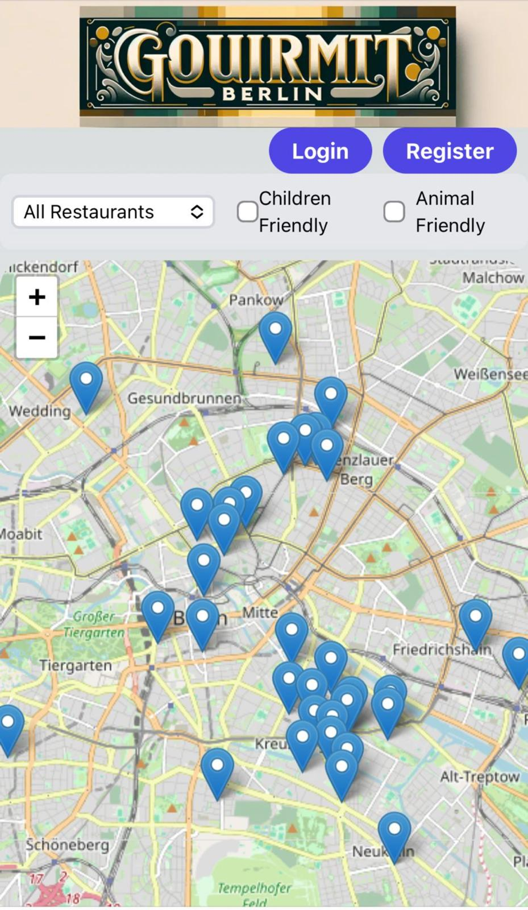

# Gourmet Berlin Frontend

Gourmet Berlin is a web application that allows users to explore high-quality restaurants in Berlin through an interactive map interface. Initially developed using Next.js and Node.js, the project has now been refactored to separate the backend and frontend. The backend is now built with Flask, while the frontend continues to use Next.js.

## Features

- **Interactive Map**: Users can view a map with pins representing high-quality restaurants. Each pin provides details about the restaurant, including cuisine type, whether it is animal or child-friendly, and directions.
- **Restaurant Details**: By clicking on a pin, users can access detailed information about each restaurant.
- **User Comments**: Registered users can comment on restaurant pages, as well as edit or delete their comments.
- **Add Restaurants**: Registered users can add new restaurants to the map, enhancing the collaborative nature of the application.

## Screenshot
